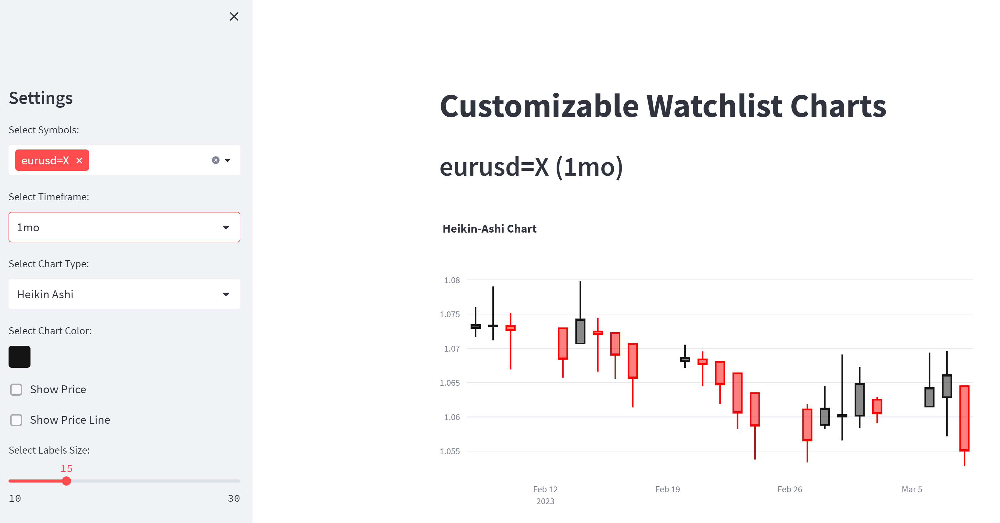

# Forex Watchlist Charts

Deployable Streamlit:
https://forexwatchlist.streamlit.app/

---

This is a Python script that creates customizable watchlist charts for financial symbols using data from Yahoo Finance. The script uses the yfinance library to retrieve financial data, and the Streamlit framework to create the interactive charts.

The script allows the user to select multiple symbols and timeframes, and customize the chart type, color, and display settings. The available chart types are candlestick, Heikin Ashi, and line charts. The script also allows the user to show the current price and a price line chart, which plots the symbol's price over time on a separate y-axis.

The app is a useful tool for investors and traders who want to quickly analyze financial data and track market trends.

---

### Select Symbols and Timeframe
In the sidebar, you can select one or more symbols from the list provided. You can also select a timeframe for the data to be displayed, from options ranging from 1 day to max.

### Chart Settings
In the sidebar, you can also customize the chart settings to suit your preference. You can select from three different chart types: Candles, Heikin Ashi, and Line. You can also choose the color of the chart, display the price and/or price line, and adjust the size of labels and text. Additionally, you can adjust the gaps between charts.

### View Charts
After selecting the symbols and chart settings, click on the 'Run' button at the top of the app to view the charts. The app will display each symbol selected, along with its chart and current price if selected. You can toggle between different chart types and adjust the chart color and settings using the sidebar options.

---

## Prerequisites

This script requires the following Python packages:

    yfinance
    streamlit
    plotly
    
You can install these packages using pip. For example:

    pip install yfinance streamlit plotly

---

## Usage

To run the app, run the following command in your terminal:

    streamlit run app.py

After running this command, the app will open in your default web browser. You can select the symbols you want to display, the timeframe, and the chart settings from the sidebar.

---

## Functions
The script contains the following functions:
  
- get_data(ticker, timeframe): retrieves financial data for a given ticker and timeframe using the yfinance library.
    
- create_candlestick_chart(data, chart_color): creates a candlestick chart using Plotly's go.Candlestick object.
    
- create_heikin_ashi_chart(data, chart_color): creates a Heikin Ashi chart using a modified version of the financial data and Plotly's go.Candlestick object.
    
- create_line_chart(data, chart_color): creates a line chart using Plotly's go.Scatter object.
    
- display_chart(data, chart_type, chart_color): displays a chart with the given type and color using one of the three chart creation functions above.
    
- main(): defines the Streamlit app and creates the main page content.
    
---
    
## Sidebar Options
The sidebar contains the following options for selecting symbols, timeframes, and chart settings:

- Select Symbols: a multiselect box for selecting one or more symbols from a list of available symbols.
    
- Select Timeframe: a select box for selecting a timeframe from a list of available timeframes.
    
- Select Chart Type: a select box for selecting a chart type from a list of available chart types (candlestick, Heikin Ashi, line).
    
- Select Chart Color: a color picker for selecting the color of the chart.
    
- Show Price: a checkbox for showing the current price of the selected symbol.
    
- Show Price Line: a checkbox for showing the price line chart of the selected symbol.
    
- Select Labels Size: a slider for selecting the font size of the chart labels.
    
- Select Text Size: a slider for selecting the font size of the chart text.
    
- Select Gaps Between Charts: a slider for selecting the gap size between the charts.
